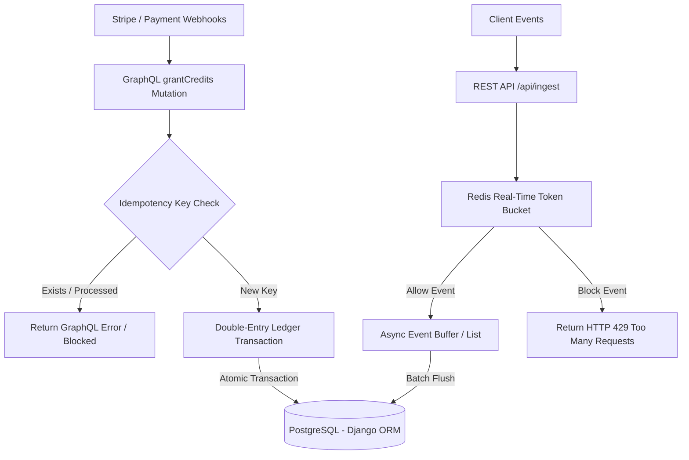

# Double-Entry Billing System & Quota Limiter

[](https://github.com)
[](https://github.com)
[](https://github.com)

A high-throughput, usage-based billing engine and double-entry ledger designed for financial auditability, zero-rounding errors, and sub-5ms quota checks. Rebuilt as a standalone production-grade backend demonstrating advanced engineering patterns in database isolation, transaction atomicity, and cache scripting.

---

## 1. System Architecture



---

## 2. Core Architectural Pillars

### 💳 Transactional Double-Entry Correctness
Naively storing account balances in a single table column introduces data corruption, race conditions, and rounding errors. This system models money as a strict double-entry ledger:
* **Account**: A financial entity of type `ASSET`, `LIABILITY`, `REVENUE`, or `EXPENSE`.
* **LedgerTransaction**: A logical transaction header grouping two or more entry legs.
* **Entry**: The transaction legs. Every ledger entry requires at least one Debit and one Credit leg where the sum of all debits equals the sum of all credits:
  $$\sum \text{Debits} = \sum \text{Credits}$$
* **Constraint Validation**: Dynamic balances are computed relative to the account type:
  * **Asset / Expense**: $\text{Balance} = \sum \text{Debits} - \sum \text{Credits}$
  * **Liability / Revenue**: $\text{Balance} = \sum \text{Credits} - \sum \text{Debits}$
* **Db-Level Safeguards**: Enforced via atomic database transaction blocks (`transaction.atomic`) and database `CheckConstraint` parameters preventing negative transaction amounts and invalid directions.

### ⚡ Sub-5ms Rate Limiting (Redis Lua)
Checking SQL balances for every user API call is too slow. To scale, this system runs a high-speed **Token Bucket** algorithm inside Redis using a custom **Lua script**:
1. It calculates user token bucket refills based on the elapsed time since the last checked timestamp.
2. It verifies availability and deducts a credit—**all in one single atomic memory operation**.
3. If allowed, it logs the event into a Redis list (`usage_buffer`) for asynchronous database writeback and returns immediately.
4. If the bucket is empty, it bypasses the database and returns **HTTP 429 Too Many Requests**.

### 🔗 Hybrid REST / GraphQL Design
* **Strawberry Django GraphQL**: Exposes the schema for querying accounts, ledger entries, and transaction details. Perfect for dashboards where clients need relational, nested queries without over-fetching.
* **REST View**: The ingest endpoint `/api/ingest` is kept as a lightweight REST route to maintain standard HTTP status codes (like `429`) and integrate cleanly with third-party webhooks.

---

## 3. Technology Stack

* **Core**: Django 5.x, Python 3.12+
* **API Layer**: Strawberry Django (GraphQL), Django JSON Views (REST)
* **Databases**: PostgreSQL 15 (transactional storage), Redis 7 (caching & rate-limiting)
* **Package Management**: Astral `uv` (compiled bytecode dependency synchronization)
* **Test Suite**: Pytest, Pytest-Django
* **Containerization**: Docker, Docker Compose

---

## 4. Getting Started

### Prerequisites
* Docker & Docker Compose installed
* Alternatively, Python 3.12+ and `uv` package manager installed

### Running with Docker Compose (Recommended)
1. Clone the repository and configure your environment:
   ```bash
   cp .env.example .env
   ```
2. Build and spin up the PostgreSQL, Redis, and Django containers:
   ```bash
   docker compose up --build -d
   ```
3. Run the migrations inside the container:
   ```bash
   docker compose exec web uv run python manage.py migrate
   ```
4. Access the sandbox interactive dashboard at:
   ```text
   http://localhost:8090/
   ```

### Running Locally (Bare Metal)
1. Initialize the virtual environment and install dependencies:
   ```bash
   uv sync
   ```
2. Run database migrations:
   ```bash
   uv run python manage.py migrate
   ```
3. Start the local server:
   ```bash
   uv run python manage.py runserver
   ```

---

## 5. Verification & Testing

Our test suite is built on top of Django's `TransactionTestCase` to support multi-threaded concurrency checks against a live PostgreSQL database, checking for deadlock scenarios.

To run the pytest suite:
```bash
uv run pytest
```

### Verified Test Cases
* **`test_double_entry_balance`**: Validates ledger credit allocations and balance math correctness.
* **`test_idempotency_keys`**: Ensures webhook inputs with the same key are rejected as duplicates.
* **`test_unbalanced_transaction_rejected`**: Confirms that entries with mismatched Debits/Credits raise `ValueError` and roll back.
* **`test_concurrent_transactions`**: Executes 10 concurrent credit allocations in parallel threads using `ThreadPoolExecutor` and asserts that final account balances match exactly without locking issues.
